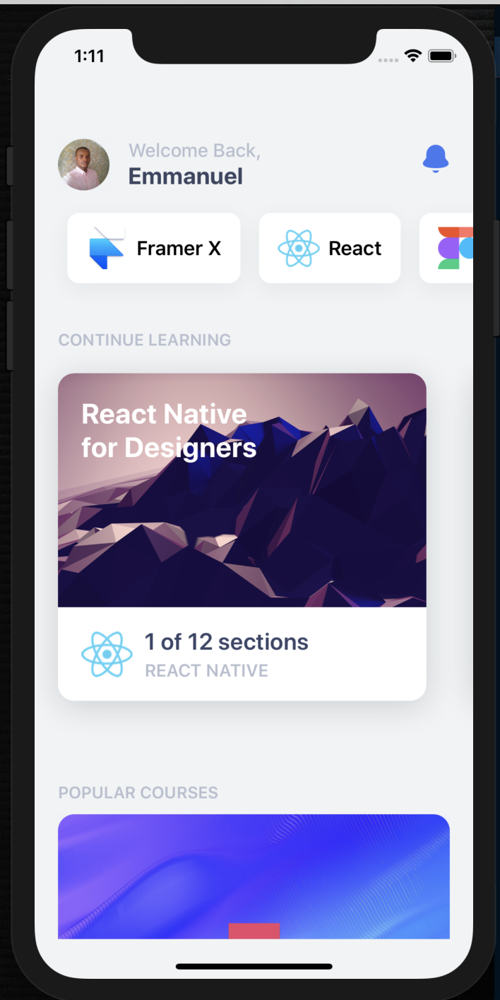

# React Native App



Install Node
Before starting, you'll need the Node package manager (NPM) for installing React and Expo. To install Node, you need to head to their site and download the version appropriate to your system. You can also install node using Homebrew (Mac only) if you prefer.

Install Xcode
If you're on a Mac, I highly recommend installing Xcode for the required Command Line Tools and for using the iOS Simulator. Xcode also comes with Git, which is wonderful for development.

Install Expo
Expo will allow us to have a development environment for creating our app. Go to Terminal and type this command and press Enter.

```
sudo npm install expo-cli --global
```

Go to their Quick Start guide for more detailed instructions.

Go to your new project's folder and start the environment.

```
expo start
```

Install Libraries

```
npm install
```
